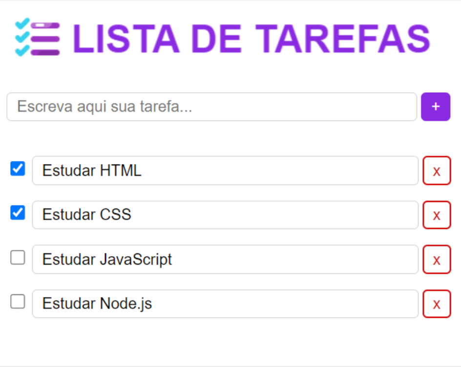

# Série Dev Explorer - Projeto Full-stack

## 1. Projeto

O projeto é uma Aplicação Web chamada "Lista de Tarefas", onde será possível cadastrar, excluir, listar e editar tarefas por meio de uma página Web.

Projeto: https://github.com/trilhafront/devexplorer

